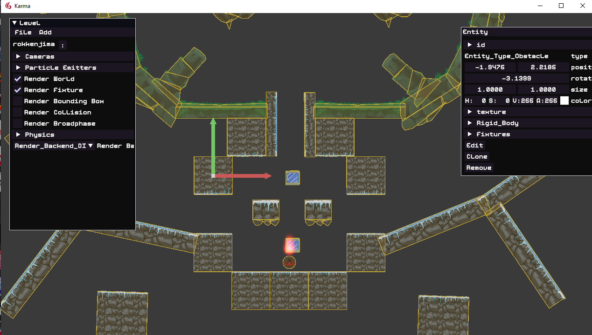

# कर्म (karma)


## Directory Structure
```bash
├── bin					  # Contains intermediate build files
├── res					  # Contains resources
│   ├── fonts			  # Fonts used in games
│   ├── logo			  # Branding
│   ├── misc			  # Miscellaneous files
│   ├── shaders			  # Shaders (they are written in our format)
│   ├── ucd				  # Unicode Database (https://www.unicode.org/ucd/)
├── run_tree			  # This is the directory where the executable is ran from
│   ├── data			  # Data required for executable
│   ├── imgui			  # Contain files used by IMGUI
│   ├── *				  # Debugging files and executables
├── src					  # Karma source code
│   ├── .generated		  # Generated files by Reflection
│		├── readme.txt	  # Instructions how to generate reflection of code and use it
│   ├── glad			  # External library (https://github.com/Dav1dde/glad)
│   ├── imgui			  # External library (https://github.com/ocornut/imgui)
│   ├── pcg				  # External library (https://github.com/imneme/pcg-c-basic)
│   ├── opengl			  # OpenGL specific code
│   ├── windows			  # Windows specific code
│   ├── prebuild.bat	  # Windows Batch file for Reflection (more at .generated/readme.txt)
│   ├── *.cpp, *.h		  # Source and header CPP files
├── tools				  # Tools that are used by Karma
│   ├── reflection		  # Generated files by Reflection
│   ├── ucd				  # Unicode Database To Code Generator
├── *.vcxproj*			  # Visual Studio Project Files
├── readme.md
├── todo.txt
├── .gitattributes
└── .gitignore
```

## Build Process (Windows)
- Set your Working Directory as `run_tree` directory
- Build using visual studio and run the exe generated in `run_tree`
- There is built exe present in `run_tree` directory already if you don't want to go through the build process
- Executable with suffix `_Developer` contains Editor

## Running with custom Ip Address
- Create a file named `server.txt` in `run_tree/dev/` directory
- The content of the file should be valid ip address
- The engine will run with the ip address in that file if that file is present

## Developer Controls
- F1 : Pauses / Resumes Game Time
- F2 : Decreases Game Speed
- F3 : Increases Game Speed
- F4 : Enables / Disables Debug View
- F5 : Enables / Disables Editor
- F6 : Resets Level

## Usage
- There are no docs as of right now, but the entry point is at `first.cpp`
- See `template.cpp` for setting up start up code
- See `scene.cpp` for various features of the engine in action

## Example Game Control
- [W], [A], [S], [D]: Player Controls
- [Space]: Attack
- [Mouse Movement]: Target

## Screenshot





